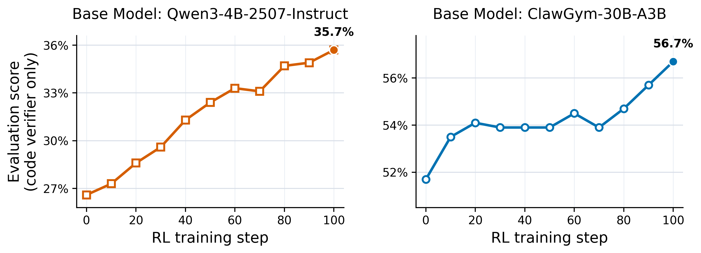

# ClawGym-RL

A lightweight RL pipeline for Claw-style agents. The OpenClaw agent loop is kept as a black box and each
task is virtualized into an independent sandbox. Advantages:

1. **Sandbox-parallel rollout.** Following
   [LLM-in-Sandbox](https://github.com/llm-in-sandbox/llm-in-sandbox), many
   task rollouts run concurrently without interfering with each other on a single machine.

2. **Docker-free backend.** The default sandbox backend is Docker,
   and we also support `chroot` backend for environments where Docker is restricted.

3. **Black-box agent loop.** Zero modifications to OpenClaw: the trainer
   talks to the sandboxed agent through its standard chat API, so any
   OpenClaw variant drops in without code changes on either side.


<p align="center">
  
</p>

## Setup

Run inside the [slimerl/slime:latest](https://thudm.github.io/slime/get_started/quick_start.html#pull-and-start-docker-containere) docker image, then
install the trainer in editable mode:

```bash
cd ClawGym-RL
pip install -e ./slime --no-deps
```

Next, pick a sandbox backend. Both expose the same interface to the trainer; you only need to set up one.

### Option A: Docker

Used by default. Pick any official [OpenClaw](https://docs.openclaw.ai/install/docker) release as the base image; the snippet below adds a thin pip setup layer on top so the trainer can drive the agent. At rollout time, one Docker container is launched per task from this image.

<details>
<summary>Install Docker (skip if already available)</summary>

```bash
curl -fsSL https://get.docker.com -o get-docker.sh && sh get-docker.sh
dockerd > /var/log/dockerd.log 2>&1 &
```

Or follow the [official Docker docs](https://docs.docker.com/engine/install/).

</details>

<details>
<summary>Build the sandbox image (one-time)</summary>

```bash
export OPENCLAW_IMAGE=ghcr.io/openclaw/openclaw:2026.4.1  # Or any other OpenClaw image version
docker pull $OPENCLAW_IMAGE
docker run -d --name tmp $OPENCLAW_IMAGE sleep 60
docker exec --user root tmp sh -c '\
  ln -sf /usr/bin/python3 /usr/bin/python && \
  rm -f /usr/lib/python*/EXTERNALLY-MANAGED && \
  python3 -c "import urllib.request; urllib.request.urlretrieve(\"https://bootstrap.pypa.io/get-pip.py\", \"/tmp/get-pip.py\")" && \
  python3 /tmp/get-pip.py -q && rm /tmp/get-pip.py'
docker commit tmp clawgym-rl:v0.1 && docker rm -f tmp
```

</details>

### Option B: Docker-Free (chroot)

No Docker daemon needed. **Requires root.** Switching on at training time is a single
env var: `OPENCLAW_ROOTFS=/tmp/openclaw-bundle/rootfs`.

<details>
<summary>Setup rootfs (one-time)</summary>

```bash
export OPENCLAW_IMAGE=ghcr.io/openclaw/openclaw:2026.4.1 # Or any other OpenClaw image version

apt-get install -y skopeo umoci
skopeo copy docker://$OPENCLAW_IMAGE oci:/tmp/openclaw-oci:latest
umoci unpack --image /tmp/openclaw-oci:latest /tmp/openclaw-bundle
bash build_rootfs.sh /tmp/openclaw-bundle/rootfs   # needs root (mknod, chown)
```

</details>


## Quick start

Default (Docker backend, image built in
Option A):

```bash
WANDB_KEY=your_wandb_key \
bash run_qwen3_4b.sh
```

With the chroot backend (set `OPENCLAW_ROOTFS` to the rootfs built in
Option B):

```bash
WANDB_KEY=your_wandb_key \
OPENCLAW_ROOTFS=/tmp/openclaw-bundle/rootfs \
bash run_qwen3_4b.sh
```

Both the training reward and the eval score in the wandb logs are computed with code-based verifiers only (weight 1.0; no rubric-based judgment).

## Data

The train and eval datasets are already prepared under `data/`. No extra preparation is needed; just run the training script.

The 2,000 training tasks are selected from [RUC-AIBOX/ClawGym-Task](https://huggingface.co/datasets/RUC-AIBOX/ClawGym-Task) and the eval split is the full [RUC-AIBOX/ClawGym-Bench](https://huggingface.co/datasets/RUC-AIBOX/ClawGym-Bench).

To enlarge the training set or add your own tasks, see [DATASET_README.md](data/DATASET_README.md).

## Acknowledgment

We learned from [slime](https://github.com/THUDM/slime) and [OpenClaw-RL](https://github.com/Gen-Verse/OpenClaw-RL). Thanks for the great work!

## Contact

Feel free to open an issue, or reach [Daixuan Cheng](https://cdxeve.github.io) at `daixuancheng6@gmail.com`.
