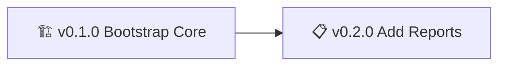

# Diagram Rules (Local)

Authoritative local rules for roadmap diagram generation. These override any global rules where they conflict.

- Diagram type: mermaid graph
- Direction: LR (left-to-right)
- Source: Parse epics from ROADMAP.md
  - Epic structure:
    1) A line starting with "## vX.Y.Z"
    2) Next line "### <Status>"
    3) Next line: single-line epic name
- Include: All discovered epics
- Ordering: Ascending semantic version (v0.1.0, v0.2.0, ...)
- Edges: Connect nodes sequentially with "-->"
- Node label format: "[<status_emoji> v<version> <epic_name>]"
- Status emoji mapping:
  - Active Epic: 🏗️
  - Backlog Epic: 📋
  - Completed Epic: ✅

Example rendering for two epics:
